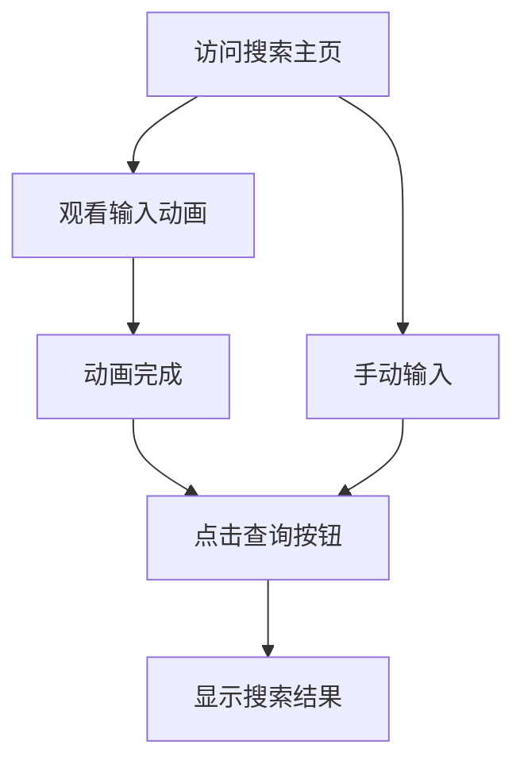

# React搜索页面产品需求文档

## 1. Product Overview
一个基于React的交互式搜索页面，展示流畅的输入动画效果和响应式设计。
该产品主要用于演示搜索功能的用户体验，特别适合录屏展示和产品演示场景。

## 2. Core Features

### 2.1 User Roles
本产品无需用户角色区分，所有访问者均可直接使用搜索功能。

### 2.2 Feature Module
我们的搜索页面需求包含以下主要页面：
1. **搜索主页**：搜索框组件、动画效果控制、查询按钮交互

### 2.3 Page Details

| Page Name | Module Name | Feature description |
|-----------|-------------|---------------------|
| 搜索主页 | 搜索框组件 | 包含输入框和查询按钮的响应式设计，支持桌面和移动端适配 |
| 搜索主页 | 输入动画效果 | 自动模拟输入"bearecho.com"的打字动画，可控制播放速度和暂停 |
| 搜索主页 | 查询按钮交互 | 点击查询按钮触发搜索动作，包含按钮状态变化和反馈效果 |
| 搜索主页 | 动画控制面板 | 提供开始动画、重置、暂停等控制功能，便于录屏操作 |

## 3. Core Process

用户访问页面后，可以观看自动播放的输入动画，也可以手动控制动画播放。动画完成后点击查询按钮查看搜索效果。

## 4. User Interface Design

### 4.1 Design Style
- 主色调：现代蓝色 (#007bff) 和白色 (#ffffff)
- 辅助色：浅灰色 (#f8f9fa) 和深灰色 (#6c757d)
- 按钮样式：圆角设计，悬停时有阴影效果
- 字体：系统默认字体，搜索框16px，按钮14px
- 布局风格：居中卡片式设计，简洁现代
- 动画风格：平滑过渡，打字机效果

### 4.2 Page Design Overview

| Page Name | Module Name | UI Elements |
|-----------|-------------|-------------|
| 搜索主页 | 搜索框组件 | 白色背景卡片，圆角边框，阴影效果，输入框占据主要空间，右侧蓝色查询按钮 |
| 搜索主页 | 输入动画效果 | 光标闪烁效果，字符逐个出现，自然的打字节奏 |
| 搜索主页 | 查询按钮交互 | 蓝色背景，白色文字，悬停时颜色加深，点击时有按压效果 |
| 搜索主页 | 动画控制面板 | 页面底部小型控制按钮组，包含播放、暂停、重置功能 |

### 4.3 Responsiveness
产品采用移动端优先的响应式设计，在桌面端、平板和手机上均有良好的显示效果，支持触摸交互优化。