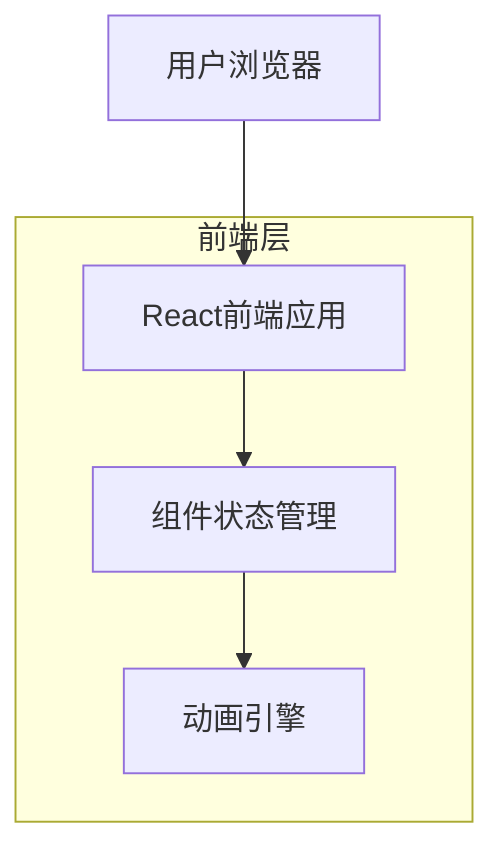
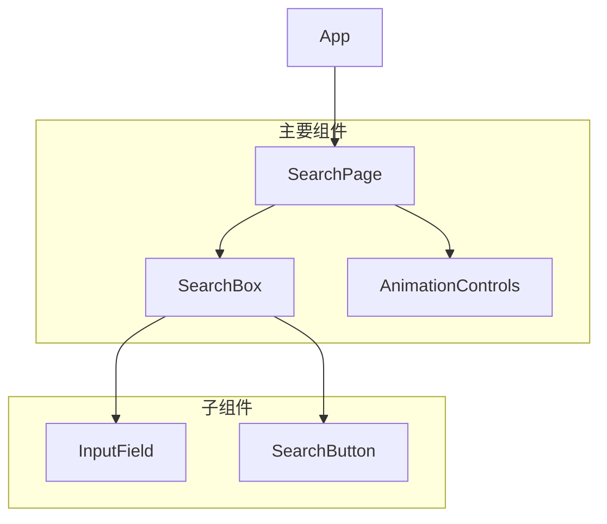

# React搜索页面技术架构文档

## 1. Architecture design



## 2. Technology Description

* Frontend: React\@18 + TypeScript\@5 + Vite\@5

* Styling: CSS Modules + CSS动画

* State Management: React Hooks (useState, useEffect)

* Animation: 原生CSS动画 + JavaScript定时器

* Backend: None

## 3. Route definitions

| Route | Purpose             |
| ----- | ------------------- |
| /     | 搜索主页，包含搜索框组件和动画效果展示 |

## 4. API definitions

本项目为纯前端应用，无需后端API。所有功能通过前端组件状态和动画实现。

## 5. Data model

### 5.1 Data model definition

本项目无需数据库，所有数据通过组件状态管理。

### 5.2 组件状态结构

```typescript
// 搜索组件状态接口
interface SearchState {
  inputValue: string;           // 当前输入框值
  isAnimating: boolean;         // 是否正在播放动画
  animationSpeed: number;       // 动画速度（毫秒）
  targetText: string;           // 目标文本 "bearecho.com"
  currentIndex: number;         // 当前动画字符索引
  isSearching: boolean;         // 是否正在搜索
}

// 动画控制接口
interface AnimationControls {
  start: () => void;            // 开始动画
  pause: () => void;            // 暂停动画
  reset: () => void;            // 重置动画
  setSpeed: (speed: number) => void; // 设置动画速度
}
```

## 6. 组件架构设计



## 7. 核心功能实现方案

### 7.1 输入动画实现

* 使用 `setInterval` 控制字符逐个显示

* 通过 `useState` 管理当前显示的字符数量

* 添加光标闪烁效果的CSS动画

### 7.2 响应式设计

* 使用CSS Grid和Flexbox布局

* 媒体查询适配不同屏幕尺寸

* 触摸设备优化的按钮大小

### 7.3 交互效果

* CSS transition实现按钮悬停效果

* 点击反馈通过状态变化和CSS动画

* 键盘事件支持（Enter键触发搜索）

### 7.4 录屏优化

* 可调节的动画速度

* 清晰的视觉反馈

* 流畅的60

